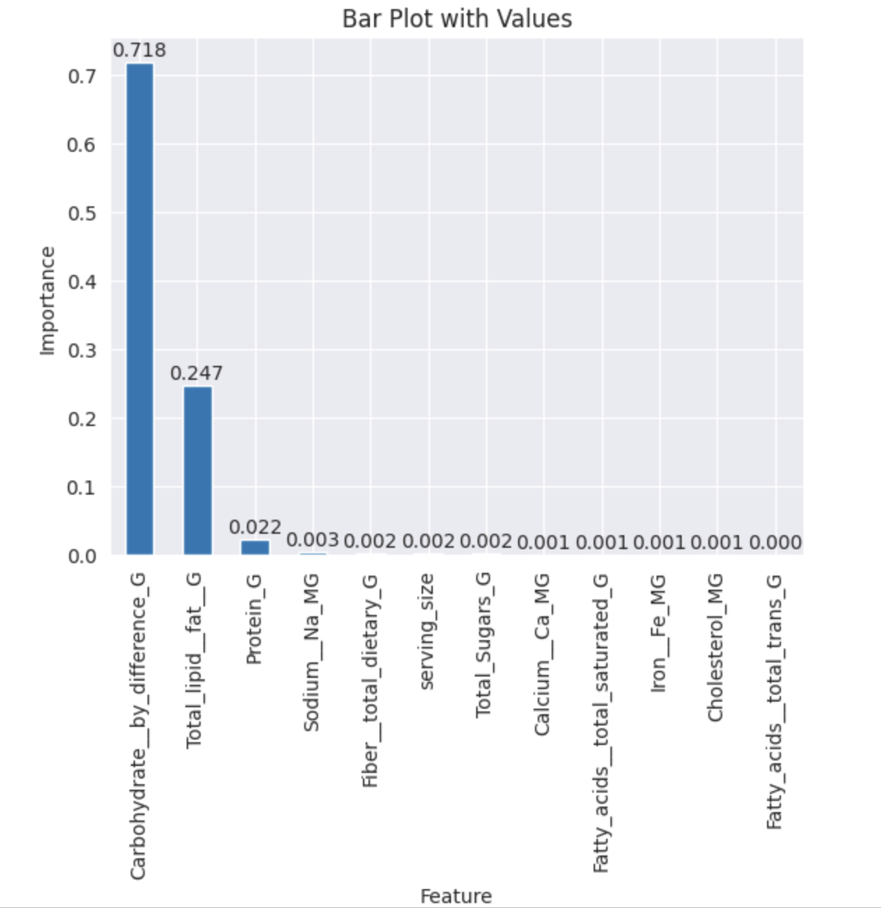

# Capstone Project - Final Report
## Topic: Predicting Energy Profile for Branded Foods

### Problem Statement
We see multiple branded food categories that have different energy and nutrient profiles - some of these branded food items also highlight multiple benefits (examples include low sugar, high fiber etc.) - the presence of so many data points can make it difficult for consumers to make an informed choice in a short time.

Machine learning concepts can be applied on a dataset that contains nutritional information and additional supporting factors for a large variety of branded food items available in the market today to understand which nutrients determine the overall calorie value for a particular food item and also predict the energy profile based on the nutrient composition.

The objective of this project is to extract the branded food data provided by USDA FDC website, do necessary transformations using EDA techniques, train a machine learning model that can identify the relationship between energy and individual nutrient values and also predict the calories for any food label using the trained model

### Model Outcomes or Predictions
For this exercise, a supervised regression learning approach is used since the objective is to predict the energy values based on nutrient profile. The expected output is a predicted energy value based on the nutrient composition provided in the food label

### Development Details
- The Jupyter notebook capstone_final.ipynb has the code and execution results for each phase listed above
- The file data_prep_bq.sql is a BigQuery query template that reads the different CSV files downloaded from the USDA FDC website for branded data and conducts necessary joins and pivots to get the data in the required format for this project.
- The file final_result_v2_csv.zip contains the file final_result_v2.csv, which is the output of the BigQuery execution and is used as the starting point in the Jupyter notebook
- The file 'Capstone - Food Category Mapping-Sheet1.csv' is an offline manual exercise to clean the number of branded food categories. Additional context can be viewed in the Jupyter notebook

### High Level Approach
This project largely follows the CRISP-DM framework where the below phases are executed:

<ins>Phase 0: Data Acquisition</ins>: This phase involves reviewing the individual CSV files downloaded from USDA's FDC website and consolidating them into a single CSV file for this project

<ins>Phase 1: Data Understanding</ins>: This phase imports the CSV file prepared above and does an initial exploration for understanding the columns and discovering patterns that need to be addressed

<ins>Phase 2: Data Preprocessing and Preparation</ins>: This phase leverages multiple exploratory data analysis (EDA) techniques to make necessary changes to the dataset to make it more usable for building machine learning models

<ins>Phase 3: Modeling</ins>: The prepared data would then be used for training multiple regression models, taking linear regression as the baseline

<ins>Phase 4: Model Evaluation and Hyperparameter Tuning</ins>: The trained models are then evaluated after which the target model is chosen for hyperparameter tuning

<ins>Phase 5: Conclusion, Deployment and Key Insights</ins>: The final model is then reviewed to check relative importance of individual features, document key insights and also test the model with a few real life examples

### Phase 0: Data Acquisition 
The data for this project comes from the Food Data Central (FDC) section in the US Department of Agriculture (USDA) website. The FDC webpage hosts comprehensive datasets with detailed information about different food products - the data has been gathered from different sources including Foundation Foods, Experimental Foods, and the USDA Global Branded Food Products Database.

For this project, the focus is on analyzing the branded food data provided by FDC. The data can be downloaded here and has multiple CSV files. For this project the below data sources are considered from the website:
- branded_food.csv: This file has the data of all branded food items, including a unique ID, manufacturing company, food name, food category, serving size, serving size unit and list of ingredients
- nutrient.csv: This file has a list of nutrients, including the unique nutrient ID and nutrient name
- food_nutrient.csv: This file shows the nutrients (indicated by unique IDs used in the nutrient.csv file) for each branded food item (indicated by their unique ID in the branded_food.csv file) along with their amounts

For this project, it was important to consolidate the date from the above three files into a single CSV file which has one row for each branded food item with individual columns that shows the quantity of each nutrient, along with the overall energy and serving size values. The below visualization shows how the consolidation is done through multiple joins across the 3 files.

To achieve this, the 3 files were imported to 3 different BigQuery tables after which a BigQuery query was prepared to complete the consolidation. The template query can be viewed in the file [data_prep_bq.sql](https://github.com/devimanava/capstone-project/blob/main/data_prep_bq.sql).

### Phase 1: Data Understanding
The data file created above was loaded into Pandas dataframe in Jupyter notebook and reviewed. The below trends were observed:
- The dataset had **89 columns and 215,740 rows**.
- There are also multiple columns with a lot of missing values - however some critical columns like Energy, Carbohydrates, Protein, Fatty Acids, Food Category and Serving Size have a good chunk of values populated
- There were no duplicate rows in the dataset
- The column fdc_id had only unique columns and the column market_country has only 2 unique values - hence these 2 need not be factored for model building 

### Phase 2: Data Preprocessing / Preparation
After reviewing the data, the below steps were taken to prepare the data for training machine learning models:

<ins>1. Address inconsistencies for categorical columns</ins>: 

The below steps were taken to address categorical column inconsistencies:
- The column ‘Branded Food Category’, which indicated the type of food had multiple unique values indicating the same type (e.g. 'Baby/Infant Foods/Beverages' and 'Baby/Infant – Foods/Beverages'). These values were cleaned up to make them distinct. Additionally, food categories with 100 or less occurrences were removed from the dataset to reduce skewness
- The serving size unit column also had overlapping values (e.g. ‘g’ and ‘GRM’). This was also cleaned up to have only distinct, unique values

<ins>2. Address inconsistencies for numerical columns</ins>: 

The below steps were taken to address inconsistencies (missing values, distribution skewness etc.) for numerical columns:
- To address missing values in the serving size column, the value with maximum frequency was used to replace the missing values for each for each branded food category and serving size unit combination - this ensured the most probable serving size was used for a particular serving size unit within each branded food category
- A lot of nutrient value columns had 80%+ values missing - such columns were dropped since they wouldn’t add much to the analysis
- Many columns had right skewed data. To address this the z-score method was used to remove outliers and reduce the skeweness of the data

<ins>3. Reviewing the data’s potential to solve the problem</ins>:

The branded food category column was encoded using one-hot encoding to perform correlation analysis. The below fields showed a positive / negative correlation of 20%+ with the target column ‘Energy_KCAL’

| Feature Name | Correlation Coefficient |
|----------| ---------- |
| Carbohydrate__by_difference_G  | 0.769 |
| Total_lipid__fat__G | 0.694
| Total_Sugars_G | 0.486
| Fatty_acids__total_saturated_G | 0.479
| Fiber__total_dietary_G  | 0.478
| branded_food_category_Snack, Energy & Granola Bars (one-hot encoded) | 0.393
| Protein_G | 0.330
| Iron__Fe_MG | 0.323
| branded_food_category_Cereal (one-hot encoded) | 0.227
| branded_food_category_Yogurt | -0.671
| serving_size | -0.672

Keeping the encoded food category column aside, the correlation matrix looks like the one below:

<ins>4. Data splitting approach</ins>:

The entire was data was then split into test and training data with the below considerations:
- 30% of the data was considered for testing
- Data was shuffled before splitting - this reduces the probability of both test and training data sets being skewed towards one food category

### Phase 3: Modeling

For this project, the below regression machine learning models were considered since the objective was to predict the energy value based on nutrient columns:
<ins>Linear Regression (baseline model)</ins>

Linear regression model was chosen as the initial baseline model and trained to predict the energy value based on the retained nutrient columns

<ins>Decision Tree Regression</ins>

Decision tree regression was considered since it can be used to predict non-linear relationships - however they tend to overfit when the depth of the tree is not regulated

<ins>K-Nearest Neighbor Regression</ins>

KNN regression was chosen as an alternative since it works well when the data is complex and has non-linear relationships 

<ins>Random Forest</ins>
Random forest is an ensemble technique that leverages multiple decision trees and takes the average prediction to reduce overfitting and increase accuracy

<ins>Support Vector Regression (SVR) </ins>

SVR was considered due to its relative robustness on outliers and also its ability to model non-linear relationships. However while the notebook has the code to train an SVR on the data provided, the code never completed its execution due to repeated kernel panics - hence this model was not used in the analysis

### Phase 4: Model Evaluation and Hyperparameter Tuning

All the above regression models were evaluated based on the MSE (mean squared error), MAE (mean absolute error) and R2 values. While R2 value shows how the nutrient columns are able to predict the variability in energy values, the MSE and MAE values indicate the level of deviations between the actual and predicted energy values for the same nutrient profile.

When the above models were trained, the below scores were obtained for the test and training data:

<ins>Training Data</ins>:

| Model | MSE | MAE | R2 |
|-------| ------ | ------ | ------ |
Linear Regression | 676.186655 | 12.852037 | 0.965690 |
Decision Tree Regression | 62.920444 | 0.720777 | 0.996807
KNR | 187.403007 | 3.791969 | 0.990491
Ridge | 676.186657 | 12.852324 | 0.965690
Random Forest | 78.685902 | 1.412735 | 0.996007

<ins>Test Data</ins>
| Model | MSE | MAE | R2 |
|-------| ------ | ------ | ------ |
Linear Regression | 690.553756 | 12.837011 | 0.964771
Decision Tree Regression | 212.173563 | 2.038302 | 0.989176
KNR | 312.497983 | 5.483400 | 0.984058
Ridge | 690.552414 | 12.837281 | 0.964771
Random Forest | 181.207822 | 2.627052 | 0.990756

From the above tables, the random forest regression model seems to be the best option due to the following reasons:
- It had the best MSE and R-squared scores for test data when compared to the other models, even though decision tree regression had slightly better scores on training data (this could be due to overfitting)
- Random forest inherently reduces overfitting since it's an ensemble method leveraging multiple decision trees, averaging the prediction of individual trees.

The random forest regression model was then taken for hyperparameter tuning using GridSearchCV. The ridge regression model was also considered for hyperparameter tuning as a baseline. The results from this exercise are shown below:

<ins>Training Data</ins>:

| Model | MSE | MAE | R2 |
|-------| ------ | ------ | ------ |
Ridge (After Tuning) | 676.186657 | 12.852324 | 0.965690
Random Forest (After Tuning) | 298.921546 | 9.513188 | 0.984832

<ins>Test Data</ins>

| Model | MSE | MAE | R2 |
|-------| ------ | ------ | ------ |
Ridge (After Tuning) | 690.552414 | 12.837281 | 0.964771
Random Forest (After Tuning) | 347.374416 | 9.891508 | 0.982279

The above tables indicate that while hyperparameter tuning reduced the accuracy of both ridge and random forest models (indicated by higher MSE and lower R-squared), the random forest model still looks to be the best bet. The comparison between actual and predicted values post hyperparameter tuning on random forest model is shown below:

### Phase 5: Conclusion, Deployment and Key Insights

<ins>Relative Importance of Features</ins>:

For the tuned random forest regression model, the relative feature importance can be viewed below:

The below inferences can be made based on the above:

- While carbohydrate and lipid content has a very big say in the energy content of a food item, total sugars and cholesterol has very little influence even though they had very less percentage of null values originally (6% and 10% respectively). This could be because the values for sugars and cholesterol are themselves very small per serving size
- Protein and to a very small extent sodium has some importance when making energy value predictions
- It is interesting to see that serving size and fiber has very little influence at all on energy calculations in the random forest model. Logically, serving size would have had a positive correlation with energy values (larger the portion size, greater the energy) - but while this may be true for a specific food category, serving size may not be a good predictor for energy across food categories since energy per unit serving size would vary

<ins>Testing the Model with Real World Data</ins>

The tuned random forest model was tested on 2 real life food labels:

- A pretzel food packet with 100 calories per serving size: The model predicted 94.3 as the energy value
- A salad with 15 calories per serving size: The model predicted 18.6 kCAL as the energy value
- A frozen pizza with 340 kCAL per serving size: The model predicted 338 kCAL as the energy value

<ins>Key Insights and Conclusion</ins>

From the above exercise, the below insights can be inferred:
- The energy values can be predicted from the nutrient information provided in the food labels with reasonable levels of accuracy
- While most regression models were able to capture the variability in the energy values based on the nutrient profile to a great degree, random forest regression model exhibited the most optimal MSE (mean squared error) values on the test data
- Carbohydrate and total lipid content were the most influential in predicting energy values, followed by protein
- Serving size did not have a strong correlation with energy since different food types have different energy values per unit serving size
- The predictions made from the tuned random forest model were reasonably close to the actual calorie values in the examples used, indicating that the nutrient information in the food label accounts for most of the variability in the energy values

